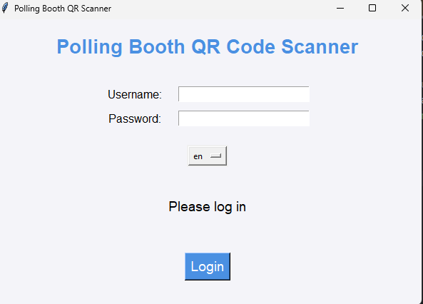
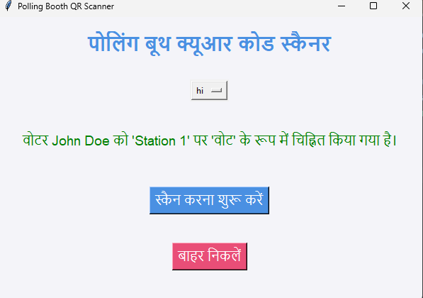

#  
# A Modern Polling Booth QR Code Scanner 📊✨
**VoteXpress** is an innovative solution designed to streamline the voter verification process at polling booths using QR codes. By leveraging Google Sheets, QR code scanning, voice commands, and an intuitive interface, it empowers polling station operators to verify voters quickly and accurately. Whether you're a tech enthusiast, a developer, or just interested in cutting-edge voting tech, this project is a game-changer!
 
---

## **Features:**


- 📱 **QR Code Scanning:** Scan QR codes to easily fetch voter details.
- 🎤 **Voice Commands:** Use voice commands to trigger key actions like scanning QR codes and exiting the app.
- 🗳️ **Voter Verification:** Real-time verification against a Google Sheet database, ensuring data accuracy.
- 🌐 **Multi-Language Support:** Seamless translation between English and Hindi (with potential for more languages).   
- 🔒 **Secure Login:** Authenticate operators with secure usernames and passwords from Google Sheets.
- 📈 **Polling Data Tracking:** Record the polling station and update voter status (Voted/Not Voted) directly in Google Sheets.
  
---

## **Installation and Setup** 🛠️

To get started, follow these steps to set up and run the **VoteXpress** app on your machine.

### 1. **Clone the Repository:**
   Clone this repo to your local machine using Git:
   ```bash
   git clone https://github.com/iapoorv01/VoteXpress.git
   cd VoteXpress
   ```

### 2. **Install Required Libraries:**
   Make sure you have Python 3.7 or higher installed. Then, install the dependencies using `pip`:
   ```bash
   pip install -r requirements.txt
   ```

   The `requirements.txt` file includes all necessary libraries, including:
   - `gspread` - For Google Sheets API.
   - `oauth2client` - For authenticating with Google Sheets.
   - `speech_recognition` - For voice command processing.
   - `opencv-python` - For QR code scanning.

### 3. **Get Your Google Sheets Credentials:**
   - Create a Google Cloud project and enable the **Google Sheets API**.
   - Download your **service account JSON credentials** file and save it as `trial.json`.
   - Place this `trial.json` file in the root directory of the project (next to the `.py` file).

   📌 **Important:** Update the Google Sheets API access credentials and ensure your Google Sheets are set to allow the service account to access the data.

### 4. **Run the Application:**
   To run the app, use the following command:
   ```bash
   python VoteXpress.py
   ```

   This will launch the graphical user interface (GUI) where you can login, scan QR codes, and track voter status.

---

## **How It Works** 🧐 


### **Login Process:**
- **Operator Login:** Operators log in using their **username** and **password** stored in a Google Sheet.
- **Polling Station Assignment:** After a successful login, the operator is assigned to a polling station.
  
### **QR Code Scanning:**
- Once logged in, the operator can use the **QR Code Scanner** to scan a voter's QR code.
- **Voter Validation:** The app verifies the voter against the Google Sheets database. If all data matches and the voter is eligible, the status is updated to **Voted**.

### **Voice Command Integration:**
- **Scan QR:** Trigger QR code scanning by simply saying "Scan QR".
- **Exit:** Exit the application by saying "Exit".

---


## **Customizations & Future Improvements** 💡

While the current version supports English and Hindi, we are planning to add **multi-language support** in the future. You can contribute to translating the interface to different languages!

In the future, **Gemini** integration can be explored for even more powerful features like automated translations and intelligent suggestions.

---

## **Contributing** 👨‍💻👩‍💻

We welcome contributions! If you'd like to contribute to the project, here’s how:

1. Fork the repo.
2. Create a new branch (`git checkout -b feature/your-feature`).
3. Make your changes.
4. Commit your changes (`git commit -am 'Add some feature'`).
5. Push to the branch (`git push origin feature/your-feature`).
6. Create a new Pull Request.

---

## **License** 📜

This project is open-source and available under the [MIT License](LICENSE).

---

## **Contact & Support** 🤝

If you have any questions or need support, feel free to contact us via [Email/LinkedIn/GitHub Issues]. We’re here to help!

---

## **Demo** 📸

Here's a sneak peek at how **VoteXpress** works:


*Login Page & QR Scanner*


*Voter Verified Successfully*

---

**Join the revolution of smart, efficient, and secure voting processes!** 🚀

---

### **Thank you for using VoteXpress!** 💙

